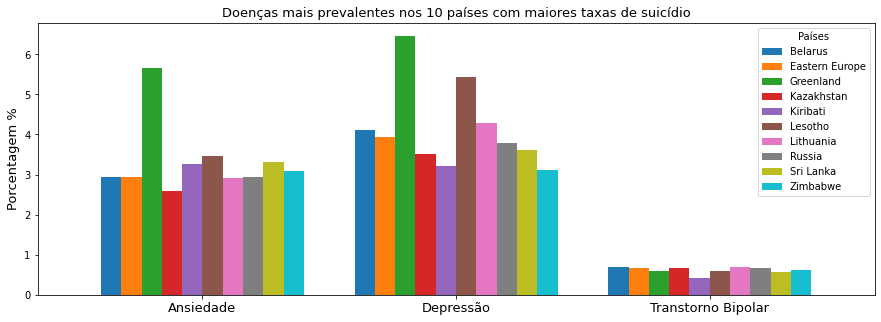
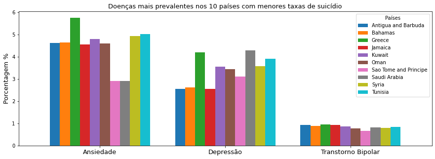

# Etapa Final

## Projeto Saúde Mental

## Equipe Data Health

* Marília Correa da Silva Santos
* Gustavo Praciano Barros

## Slides da Apresentação da Etapa Final
[Slides](https://github.com/mariliacss/DataHealth/blob/main/EtapaFinal/slides/Apresenta%C3%A7%C3%A3o%20final%20.pdf)

## Resumo do Projeto

Projeto com a intenção de correlacionar os casos de suicídio pelo mundo com as doenças mentais mais comuns, como depressão, ansiedade, bipolaridade, verificando sua influência nos países com maiores taxas de suicídio.

## Motivação e Contexto 

Atualmente, as notícias sobre saúde mental e sua importância estão cada vez mais presentes em nosso cotidiano. Estmos sempre sendo bombardeados sobre saúde mental no trabalho, na faculdade ou colégio, em casa, etc. E com o isolamento social na pandemia, a reflexão sobre esse assunto acabou se tornando inevitável devido ao logo tempo sozinho sem poder seguir uma rotina e ver as pessoas que gostamos. Além disso, também é comum vermos notícias sobre suicídio associada a falta de saúde mental, principalmente depressão. Nesse contexto, ficamos interessados em pesquisar a respeito dessa relação entre casos de suicídio e as desordens mentais mais comuns no mundo.

## Detalhamento do Projeto *

Apresente aqui detalhes da análise. Nesta seção ou na seção de Resultados podem aparecer destaques de código como indicado a seguir. Note que foi usada uma técnica de highlight de código, que envolve colocar o nome da linguagem na abertura de um trecho com ~~~, tal como ~~~python. Os destaques de código devem ser trechos pequenos de poucas linhas, que estejam diretamente ligados a alguma explicação. Não utilize trechos extensos de código. Se algum código funcionar online (tal como um Jupyter Notebook), aqui pode haver links. No caso do Jupyter, preferencialmente para o Binder abrindo diretamente o notebook em questão.

~~~python
df = pd.read_excel("/content/drive/My Drive/Colab Notebooks/dataset.xlsx");
sns.set(color_codes=True);
sns.distplot(df.Hemoglobin);
plt.show();
~~~

## Evolução do Projeto *

Relatório de evolução, descrevendo as evoluções na modelagem do projeto, dificuldades enfrentadas, mudanças de rumo, melhorias e lições aprendidas. Referências aos diagramas, modelos e recortes de mudanças são bem-vindos. Podem ser apresentados destaques na evolução dos modelos conceitual e lógico. O modelo inicial e intermediários (quando relevantes) e explicação de refinamentos, mudanças ou evolução do projeto que fundamentaram as decisões. Relatar o processo para se alcançar os resultados é tão importante quanto os resultados.

## Resultados e Discussão *

Apresente os resultados da forma mais rica possível, com gráficos e tabelas. Mesmo que o seu código rode online em um notebook, copie para esta parte a figura estática. A referência a código e links para execução online pode ser feita aqui ou na seção de detalhamento do projeto (o que for mais pertinente). A discussão dos resultados também pode ser feita aqui na medida em que os resultados são apresentados ou em seção independente. Aspectos importantes a serem discutidos: É possível tirar conclusões dos resultados? Quais? Há indicações de direções para estudo? São necessários trabalhos mais profundos?





## Conclusões *

Apresente aqui as conclusões finais do trabalho e as lições aprendidas.

## Modelo Conceitual Final


## Modelos Lógicos Finais *

```
MentalHealthDisorders(country, year, disease, share)
DisordersByAge(country, year, disease, age, share)
ShareDeathsSuicide(pais, codigo, ano, porcentagemDeMortes)
RatesDeathsSuicide(pais, codigo, ano, RatesDeaths, RatesDeathsMale, RatesDeathsFemale)
RatesDetailedDeathsSuicide(pais, codigo, ano, RatesDeaths, RatesDeaths514, RatesDeaths1549, RatesDeaths5069, RatesDeaths70)
```
**FALTA COLOCAR O MODELO LÓGICO PARA OS GRAFOS**

## Conjunto de queries para todos os modelos

### SQL

As queries em SQL estão disponíveis no mesmo notebook ([link](https://github.com/mariliacss/DataHealth/blob/main/EtapaFinal/notebooks/projetoBDFinal.ipynb)) em que estão as tabelas e a conversão de dados. No notebook está detalhado em qual parte começa as queries (os links do sumário só funcionam no Binder)

[](https://mybinder.org/v2/gh/mariliacss/DataHealth/main)

### Neo4j

**Grafo ligando paises com a taxa de crescimento próxima**
```
LOAD CSV WITH HEADERS FROM 'https://raw.githubusercontent.com/mariliacss/DataHealth/main/stage03/data/processed/mediaPorcentCresDecresSuicidio.csv' AS line
CREATE (:Suicide {name: line.PAIS, media: line.MÉDIA})

CREATE INDEX ON :Suicide(name)

MATCH (s1:Suicide)
MATCH (s2:Suicide)
where s2.media-s1.media<=0.1 and s2.media-s1.media>0
MERGE (s1)-[m:Maior]->(s2)
ON CREATE SET m.weight=1
ON MATCH SET m.weight=m.weight+1

match (s1:Suicide)-[:Maior]->(s2:Suicide)
RETURN s1.name as source, s2.name as target
```
Detectando a comunidade
```
CALL gds.graph.create(
  'communityGraph2',
  'Suicide',
  {
    Maior: {
      orientation: 'UNDIRECTED'
    }
  }
)

CALL gds.louvain.stream('communityGraph2')
YIELD nodeId, communityId
RETURN gds.util.asNode(nodeId).name AS name, communityId
ORDER BY communityId ASC

CALL gds.louvain.stream('communityGraph2')
YIELD nodeId, communityId
MATCH (p:Suicide {name: gds.util.asNode(nodeId).name})
SET p.community = communityId

CALL gds.louvain.stream('communityGraph2')
YIELD nodeId, communityId
RETURN gds.util.asNode(nodeId).name AS name, communityId
```


[link para o arquivo .cys](https://github.com/mariliacss/DataHealth/blob/main/EtapaFinal/src/grafroSuicidio.cys)

**Grafo ligando paises com a mesma doença prevalente**
```
LOAD CSV WITH HEADERS FROM 'https://raw.githubusercontent.com/mariliacss/DataHealth/main/stage03/data/processed/doencaMaisPrevalente.csv' AS line
CREATE (:Disease {name: line.COUNTRY, doenca: line.DISEASE, media: line.MEDIATAXA})

CREATE INDEX ON :Disease(name)

MATCH (d1:Disease)
MATCH (d2:Disease)
where d1.doenca = d2.doenca and d1.name <> d2.name
MERGE (d1)-[p:Prevalente {doenca: d1.doenca}]->(d2)

match (d1:Disease)-[:Prevalente]->(d2:Disease)
RETURN d1.name as source, d2.name as target
```
Detectando a comunidade
```
CALL gds.graph.create(
  'communityGraph',
  'Disease',
  {
    Prevalente: {
      orientation: 'UNDIRECTED'
    }
  }
)

CALL gds.louvain.stream('communityGraph')
YIELD nodeId, communityId
RETURN gds.util.asNode(nodeId).name AS name, communityId
ORDER BY communityId ASC

CALL gds.louvain.stream('communityGraph')
YIELD nodeId, communityId
MATCH (p:Disease {name: gds.util.asNode(nodeId).name})
SET p.community = communityId

CALL gds.louvain.stream('communityGraph')
YIELD nodeId, communityId
RETURN gds.util.asNode(nodeId).name AS name, communityId
```


[link para o arquivo .cys](https://github.com/mariliacss/DataHealth/blob/main/EtapaFinal/src/grafoDoencaPrevalente.cys)

## Bases de Dados

Título | Link | Descrição
------------ | ------------- | -------------
Suicide - Our World in Data | https://ourworldindata.org/suicide | Dados e tabelas gerais sobre suicídicio.
Mental Health - Our World in Data | https://ourworldindata.org/mental-health | Dados e tabelas gerais sobre saúde mental.

## Arquivos de Dados

Nome | Link | Descrição 
------------ | ------------- | -------------
mental-health-issues.csv | [link](https://github.com/mariliacss/DataHealth/blob/main/stage03/data/external/mental-health-issues.csv) | número de pessoas com a doença indicada
prevalence-of-anxiety-disorders-by-age.csv | [link](https://raw.githubusercontent.com/mariliacss/DataHealth/main/stage03/data/external/prevalence-of-anxiety-disorders-by-age.csv) | porcentagem de pessoas com ansiedade por idade
prevalence-of-bipolar-disorder-by-age.csv | [link](https://raw.githubusercontent.com/mariliacss/DataHealth/main/stage03/data/external/prevalence-of-bipolar-disorder-by-age.csv) | porcentagem de pessoas com transtorno bipolar por idade
prevalence-of-depression-by-age.csv | [link](https://raw.githubusercontent.com/mariliacss/DataHealth/main/stage03/data/external/prevalence-of-depression-by-age.csv) | porcentagem de pessoas com depressão por idade
share-deaths-suicide.csv | [link](https://raw.githubusercontent.com/mariliacss/DataHealth/main/stage03/data/external/share-deaths-suicide.csv) | porcentagem de suicídio por pas
share-of-population-with-schizophrenia.csv | [link](https://raw.githubusercontent.com/mariliacss/DataHealth/main/stage03/data/external/share-of-population-with-schizophrenia.csv) | porcentagem de pessoas com esquizofrenia país
share-with-an-eating-disorder.csv | [link](https://raw.githubusercontent.com/mariliacss/DataHealth/main/stage03/data/external/share-with-an-eating-disorder.csv) | porcentagem de pessoas com trasntorno alimentar por país
share-with-anxiety-disorders.csv | [link](https://raw.githubusercontent.com/mariliacss/DataHealth/main/stage03/data/external/share-with-anxiety-disorders.csv) | porcentagem de pessoas com ansiedade por país
share-with-bipolar-disorder.csv | [link](https://raw.githubusercontent.com/mariliacss/DataHealth/main/stage03/data/external/share-with-bipolar-disorder.csv) | porcentagem de pessoas com transtorno bipolar por país
share-with-depression.csv | [link](https://raw.githubusercontent.com/mariliacss/DataHealth/main/stage03/data/external/share-with-depression.csv) | porcentagem de pessoas com depressão por país
suicide-death-rates-by-sex.csv | [link](https://raw.githubusercontent.com/mariliacss/DataHealth/main/stage03/data/external/suicide-death-rates-by-sex.csv) | taxas de suicídio por sexo
suicide-rates-by-age-detailed.csv | [link](https://raw.githubusercontent.com/mariliacss/DataHealth/main/stage03/data/external/suicide-rates-by-age-detailed.csv) | taxas de suicídio por país
MentalHealthDisorders.csv | [link](https://raw.githubusercontent.com/mariliacss/DataHealth/main/stage03/data/processed/MentalHealthDisorders.csv) | porcentagem de doenças mentais por país
doencaMaisPrevalente.csv | [link](https://raw.githubusercontent.com/mariliacss/DataHealth/main/stage04/data/processed/doencaMaisPrevalente.csv) | média da porcentagem da doença mais provalente por país
grafoAnsiedadeDepressao.csv | [link](https://raw.githubusercontent.com/mariliacss/DataHealth/main/stage04/data/processed/grafoAnsiedadeDepressao.csv) | grafo ligando os paises que tem a mesma doença prevalente
grafoAnsiedadeDepressaoComunidade.csv | [link](https://raw.githubusercontent.com/mariliacss/DataHealth/main/stage04/data/processed/grafoAnsiedadeDepressaoComunidade.csv) | detecção da comuidade do grafoAnsiedadeDepressao.csv
mediaPorcentCresDecresSuicidio.csv | [link](https://raw.githubusercontent.com/mariliacss/DataHealth/main/stage04/data/processed/mediaPorcentCresDecresSuicidio.csv) | média da porcentagem de crescimento ou decrescimento de suicídio por país por país
primeiroGrafo.csv | [link](https://raw.githubusercontent.com/mariliacss/DataHealth/main/stage04/data/processed/primeiroGrafo.csv) | grafo ligando os países com taxa de crescimento semelhantes
primeiroGrafoComunidade.csv | [link](https://raw.githubusercontent.com/mariliacss/DataHealth/main/stage04/data/processed/primeiroGrafoComunidade.csv) | detecção de comunidade do primeiroGrafo.csv
