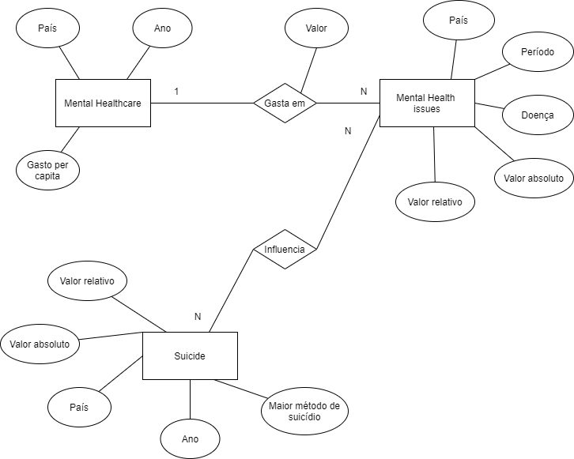

# Etapa 03 - Análises com o Primeiro Modelo Lógico
## Primeiro Modelo Conceitual



## Primeiros Modelos Lógicos

```
MentalHealthDisorders(country, year, disease, share)
DisordersByAge(country, year, disease, age, share)
ShareDeathsSuicide(pais, codigo, ano, porcentagemDeMortes)
RatesDeathsSuicide(pais, codigo, ano, RatesDeaths, RatesDeathsMale, RatesDeathsFemale)
RatesDetailedDeathsSuicide(pais, codigo, ano, RatesDeaths, RatesDeaths514, RatesDeaths1549, RatesDeaths5069, RatesDeaths70)
```

## Primeiro programa de extração e conversão de dados
[Notebook](link)

## Primeiro conjunto de queries
[Notebook](link)

## Bases de Dados

Título | Link | Descrição
------------ | ------------- | -------------
Suicide - Our World in Data | https://ourworldindata.org/suicide | Dados e tabelas gerais sobre suicídicio.
Mental Health - Our World in Data | https://ourworldindata.org/mental-health | Dados e tabelas gerais sobre saúde mental.

## Arquivos de Dados

Nome | Link | Descrição 
------------ | ------------- | -------------
mental-health-issues.csv | [link](https://github.com/mariliacss/DataHealth/blob/main/stage03/data/external/mental-health-issues.csv) | número de pessoas com a doença indicada
prevalence-of-anxiety-disorders-by-age.csv | [link](https://raw.githubusercontent.com/mariliacss/DataHealth/main/stage03/data/external/prevalence-of-anxiety-disorders-by-age.csv) | porcentagem de pessoas com ansiedade por idade
prevalence-of-bipolar-disorder-by-age.csv | [link](https://raw.githubusercontent.com/mariliacss/DataHealth/main/stage03/data/external/prevalence-of-bipolar-disorder-by-age.csv) | porcentagem de pessoas com transtorno bipolar por idade
prevalence-of-depression-by-age.csv | [link](https://raw.githubusercontent.com/mariliacss/DataHealth/main/stage03/data/external/prevalence-of-depression-by-age.csv) | porcentagem de pessoas com depressão por idade
share-deaths-suicide.csv | [link](https://raw.githubusercontent.com/mariliacss/DataHealth/main/stage03/data/external/share-deaths-suicide.csv) | porcentagem de suicídio por pas
share-of-population-with-schizophrenia.csv | [link](https://raw.githubusercontent.com/mariliacss/DataHealth/main/stage03/data/external/share-of-population-with-schizophrenia.csv) | porcentagem de pessoas com esquizofrenia país
share-with-an-eating-disorder.csv | [link](https://raw.githubusercontent.com/mariliacss/DataHealth/main/stage03/data/external/share-with-an-eating-disorder.csv) | porcentagem de pessoas com trasntorno alimentar por país
share-with-anxiety-disorders.csv | [link](https://raw.githubusercontent.com/mariliacss/DataHealth/main/stage03/data/external/share-with-anxiety-disorders.csv) | porcentagem de pessoas com ansiedade por país
share-with-bipolar-disorder.csv | [link](https://raw.githubusercontent.com/mariliacss/DataHealth/main/stage03/data/external/share-with-bipolar-disorder.csv) | porcentagem de pessoas com transtorno bipolar por país
share-with-depression.csv | [link](https://raw.githubusercontent.com/mariliacss/DataHealth/main/stage03/data/external/share-with-depression.csv) | porcentagem de pessoas com depressão por país
suicide-death-rates-by-sex.csv | [link](https://raw.githubusercontent.com/mariliacss/DataHealth/main/stage03/data/external/suicide-death-rates-by-sex.csv) | taxas de suicídio por sexo
suicide-rates-by-age-detailed.csv | [link](https://raw.githubusercontent.com/mariliacss/DataHealth/main/stage03/data/external/suicide-rates-by-age-detailed.csv) | taxas de suicídio por país
MentalHealthDisorders.csv | [link](https://raw.githubusercontent.com/mariliacss/DataHealth/main/stage03/data/processed/MentalHealthDisorders.csv) | porcentagem de doenças mentais por país
